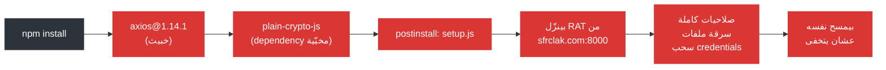

<div align="center">

# axios-scanner

**افحص لو جهازك اتضرب من هجوم axios npm supply chain (31 مارس 2026)**

[](#quick-start--windows)
[](#quick-start--linuxmacos)
[](#quick-start--linuxmacos)
[](#faq)
[](LICENSE)

<br/>

**[English README](README.md)**

[ايه اللي حصل](#ايه-اللي-حصل) ·
[ابدأ بسرعة](#ابدأ-بسرعة) ·
[بيفحص ايه](#بيفحص-ايه) ·
[لو جهازك اتهكر](#-لو-الأداة-قالت-compromised) ·
[أسئلة شائعة](#أسئلة-شائعة)

</div>

---

## ايه اللي حصل

> [!CAUTION]
> يوم **31 مارس 2026**، أكاونت الـ npm بتاع المسؤول الرئيسي عن [axios](https://www.npmjs.com/package/axios) اتسرق. اتنشر نسختين فيهم **Remote Access Trojan** على أجهزة اللي نزّلوهم. الهجوم فضل شغّال حوالي **3 ساعات** قبل ما يتكتشف ويترجّع.

axios عنده **114 مليون تحميل أسبوعياً**. لو عملت `npm install` في الوقت ده ومشروعك فيه axios، ممكن جهازك يكون اتضرب.

### الهجوم حصل ازاي



### النسخ الخبيثة

| Package | النسخة الخبيثة | النسخة السليمة |
|---------|:-:|:-:|
| axios | **`1.14.1`** | `1.14.0` |
| axios | **`0.30.4`** | `0.30.3` |

---

## ابدأ بسرعة

### Windows

> [!TIP]
> **مش محتاج Node.js أو npm أو أي أدوات برمجة.** ده بيشتغل على أي كمبيوتر Windows 10/11. PowerShell موجود عندك جاهز.

**الطريقة الأولى: أمر واحد** (أسرع حاجة)

افتح PowerShell والصق ده:

```powershell
irm https://raw.githubusercontent.com/SufficientDaikon/axios-scanner/main/get.ps1 | iex
```

**الطريقة التانية: ضغطتين**

1. [نزّل الريبو ده](../../archive/refs/heads/main.zip) وفك الضغط
2. اضغط مرتين على **`SCAN.bat`**
3. استنى الفحص يخلص
4. التقرير هيفتح أوتوماتيك في Notepad

**الطريقة التالتة: تشغيل محلي**

```powershell
powershell -ExecutionPolicy Bypass -File axios-scanner.ps1
```

### Linux/macOS

```bash
curl -fsSL https://raw.githubusercontent.com/SufficientDaikon/axios-scanner/main/axios-scanner.sh | bash
```

أو نزّل وشغّل:

```bash
chmod +x axios-scanner.sh
./axios-scanner.sh
```

---

## بيفحص ايه

الأداة بتعمل **6 مراحل على Windows** (5 على Linux/macOS) وبتسجّل كل خطوة لحظياً:

```
  PHASE 1 of 6: Looking for axios installations on your computer...
  -----------------------------------------------------------------
  [ .. ] Searching your user folder...
  [PASS] Safe: axios 1.14.0 at C:\Users\you\project\node_modules\axios
  [PASS] Safe: axios 1.13.2 (global npm)
  [PASS] RESULT: All 3 axios installations are safe versions

  PHASE 2 of 6: Looking for the malicious dropper package...
  ----------------------------------------------------------
  [PASS] Malicious 'plain-crypto-js' package was NOT found anywhere

  ...

  ============================================================
  |   VERDICT: CLEAN                                        |
  |   No signs of compromise. You are safe.                  |
  ============================================================
```

<details>
<summary><b>قائمة الفحوصات بالتفصيل</b></summary>

| # | المرحلة | بيفحص ايه | المنصة |
|:-:|---------|-----------|:------:|
| 1 | **نسخ Axios** | كل نسخة axios في مجلد المستخدم، الـ npm العام، والـ npm cache | الكل |
| 2 | **حزمة الـ Dropper** | بيدوّر على `plain-crypto-js` في أي مكان على الديسك، وملفات `setup.js` جوه مجلدات axios | الكل |
| 3 | **ملفات الـ RAT** | بيفحص لو فيه ملفات الباب الخلفي اللي الفايروس كان بينزّلها (`wt.exe`، `6202033.vbs`، `6202033.ps1` على Windows؛ `/tmp/6202033.*` على Linux/macOS) | الكل |
| 4 | **مؤشرات الشبكة** | DNS cache (Windows بس)، الاتصالات النشطة، وملف hosts لو فيه `sfrclak.com` / `142.11.206.73` | الكل |
| 5 | **آليات الثبات** | Scheduled tasks، مفاتيح الـ registry، مجلد الـ startup (Windows)؛ LaunchAgents (macOS)؛ crontab (Linux) | الكل |
| 6 | **الـ Lockfiles** | كل ملفات `package-lock.json`، `yarn.lock`، `pnpm-lock.yaml` | الكل |

</details>

### ملفات الناتج

كل فحص بينتج ملفين في نفس المجلد:

| الملف | المحتوى |
|-------|---------|
| `axios-scan-log_<timestamp>.txt` | سجل كامل خطوة بخطوة لكل اللي اتفحص |
| `axios-scan-report_<timestamp>.txt` | تقرير ملخص بالحكم والنتايج والخطوات الجاية |

---

## لو الأداة قالت COMPROMISED

> [!WARNING]
> لو أي فحص فشل، اعمل الخطوات دي **فوراً**.

### خطوة 1: افصل الإنترنت

اشيل كابل الإيثرنت أو اقفل الـ Wi-Fi. اعمل ده قبل أي حاجة تانية.

### خطوة 2: مسح تلقائي

شغّل الأداة تاني مع الـ fix flag عشان تمسح الملفات الخبيثة أوتوماتيك:

```powershell
# Windows
powershell -ExecutionPolicy Bypass -File axios-scanner.ps1 -Fix
```
```bash
# Linux/macOS
./axios-scanner.sh --fix
```

### خطوة 3: غيّر كل حاجة

الهاكر كان عنده **صلاحيات كاملة على جهازك**. افترض إن كل الـ credentials اتسرقت.

- [ ] باسوردات الإيميل (Gmail، Outlook، إلخ)
- [ ] حساب GitHub / GitLab
- [ ] حساب npm + الـ tokens
- [ ] خدمات السحابة (AWS، Azure، Vercel، Netlify، إلخ)
- [ ] مفاتيح SSH (اعمل مفاتيح جديدة، مش مجرد تغيير باسورد)
- [ ] API keys و access tokens
- [ ] أي باسوردات محفوظة في المتصفح

### خطوة 4: تدقيق

- [ ] افحص `git log` لو فيه commits ماعملتهاش
- [ ] راجع الـ CI/CD runs لو فيه deployments مش بتاعتك
- [ ] افحص الـ cloud consoles لو فيه IAM users أو resources جديدة
- [ ] بلّغ فريقك لو ده كمبيوتر شغل

---

## الخيارات

### PowerShell (`axios-scanner.ps1`)

| الفلاج | بيعمل ايه |
|--------|-----------|
| `-Fix` | بيمسح أي حاجة خبيثة يلاقيها أوتوماتيك |
| `-ScanPath "C:\path"` | بيفحص مجلد معيّن بس (أسرع) |

### Bash (`axios-scanner.sh`)

| الفلاج | بيعمل ايه |
|--------|-----------|
| `--fix` | بيمسح أي حاجة خبيثة يلاقيها أوتوماتيك |
| `--path /some/path` | بيفحص مجلد معيّن بس (أسرع) |

---

## أسئلة شائعة

<details>
<summary><b>لازم يكون عندي Node.js أو npm عشان أشغّل ده؟</b></summary>

**لأ.** الأداة دي بتستخدم PowerShell بس (Windows 10+) أو bash (Linux/macOS). بتدوّر على ملفات على الديسك باستخدام أدوات النظام اللي موجودة عندك أصلاً. لو مش منزّل Node.js، هتعدّي الفحوصات الخاصة بـ npm وهتقولك إن ده مافيهوش مشكلة.
</details>

<details>
<summary><b>الأداة دي آمنة أشغّلها؟</b></summary>

أيوه. هي بتقرا ملفات وبتفحص حالة النظام بس. مش بتعدّل أو بتمسح أو بتبعت أي حاجة إلا لو إنت استخدمت فلاج `-Fix` / `--fix` صراحةً. تقدر تقرا الكود كله — حوالي 650 سطر PowerShell مكتوبين بوضوح.
</details>

<details>
<summary><b>الفحص بياخد قد ايه؟</b></summary>

- **فحص مجلد واحد** (`-ScanPath`): حوالي 15 ثانية
- **فحص كامل لمجلد المستخدم**: من 2 لـ 5 دقايق حسب عدد الملفات عندك
</details>

<details>
<summary><b>ماكنتش بستخدم npm يوم 31 مارس. هل أنا آمن؟</b></summary>

على الأرجح أيوه. الهجوم ده أثّر بس على الناس اللي عملت `npm install` (أو حاجة زيها) في خلال الـ 3 ساعات اللي النسخ الخبيثة كانت فيها متاحة. شغّل الأداة دي عشان تتأكد.
</details>

<details>
<summary><b>الفايروس بيمسح نفسه. الأداة دي لسه تقدر تلاقيه؟</b></summary>

ملف الـ RAT بيمسح نفسه فعلاً، بس **ملفات حزمة axios الخبيثة بتفضل موجودة** في الـ `node_modules` والـ lockfiles. الأداة بتفحص ملفات الفايروس والنسخ الخبيثة من الحزمة الاتنين.
</details>

---

## مؤشرات الاختراق (IOCs)

لفرق الأمن والمراقبة:

```
# Compromised packages
axios@1.14.1  SHA-1: 2553649f2322049666871cea80a5d0d6adc700ca
axios@0.30.4  SHA-1: d6f3f62fd3b9f5432f5782b62d8cfd5247d5ee71
plain-crypto-js@4.2.1  SHA-1: 07d889e2dadce6f3910dcbc253317d28ca61c766

# C2 Infrastructure
Domain: sfrclak[.]com
IP:     142.11.206[.]73
Port:   8000
Path:   /6202033

# RAT Artifacts (Windows)
%PROGRAMDATA%\wt.exe          (نسخة PowerShell معاد تسميتها)
%TEMP%\6202033.vbs            (VBScript launcher)
%TEMP%\6202033.ps1            (PowerShell payload)

# Attacker Accounts
npm: jasonsaayman (اتسرق)  → ifstap@proton.me
npm: nrwise                   → nrwise@proton.me
```

---

## ازاي تحمي نفسك

1. **ثبّت نسخ الـ dependencies** — استخدم `"axios": "1.14.0"` مش `"^1.14.0"`
2. **اعمل commit للـ lockfile بتاعك** — `package-lock.json`، `yarn.lock`، إلخ.
3. **استخدم `npm ci`** — بيلتزم بالـ lockfile بالظبط، عكس `npm install`
4. **عطّل الـ postinstall scripts** — `npm config set ignore-scripts true`
5. **فعّل 2FA** على حساب npm بتاعك

---

<div align="center">

بناه [أحمد طه](https://github.com/SufficientDaikon) مع [Claude Code](https://claude.ai/claude-code) أثناء الاستجابة المباشرة للحادث.

لو الأداة دي ساعدتك، اعمل star للريبو وشيرها عشان غيرك يقدر يفحص جهازه كمان.

</div>
