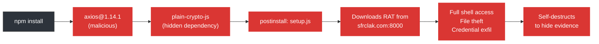

<div align="center">

# axios-scanner

**Detect if your system was compromised by the axios npm supply chain attack (March 31, 2026)**

[](#quick-start--windows)
[](#quick-start--linuxmacos)
[](#quick-start--linuxmacos)
[](#faq)
[](LICENSE)

<br/>

[What Happened](#what-happened) ·
[Quick Start](#quick-start) ·
[What It Checks](#what-it-checks) ·
[If You're Compromised](#-if-the-scanner-says-compromised) ·
[FAQ](#faq) ·
[Claude Code Prompt](#ai-powered-scan-claude-code)

</div>

---

## What Happened

> [!CAUTION]
> On **March 31, 2026**, the npm account of the primary [axios](https://www.npmjs.com/package/axios) maintainer was hijacked. Two malicious versions were published that installed a **Remote Access Trojan** on victims' machines. The attack was live for approximately **3 hours** before being detected and reverted.

axios has **114 million weekly downloads**. If you ran `npm install` during that window and your project uses axios, you may have been compromised.

### The Attack Chain



### Malicious Versions

| Package | Malicious Version | Safe Version |
|---------|:-:|:-:|
| axios | **`1.14.1`** | `1.14.0` |
| axios | **`0.30.4`** | `0.30.3` |

---

## Quick Start

### Windows

> [!TIP]
> **No Node.js, npm, or developer tools required.** This works on any Windows 10/11 computer. PowerShell is pre-installed.

**Option 1: One command** (fastest)

Open PowerShell and paste this:

```powershell
irm https://raw.githubusercontent.com/SufficientDaikon/axios-scanner/main/get.ps1 | iex
```

**Option 2: Double-click**

1. [Download this repo](../../archive/refs/heads/main.zip) and unzip it
2. Double-click **`SCAN.bat`**
3. Wait for the scan to finish
4. The report opens automatically in Notepad

**Option 3: Run locally**

```powershell
powershell -ExecutionPolicy Bypass -File axios-scanner.ps1
```

### Linux/macOS

```bash
curl -fsSL https://raw.githubusercontent.com/SufficientDaikon/axios-scanner/main/axios-scanner.sh | bash
```

Or download and run:

```bash
chmod +x axios-scanner.sh
./axios-scanner.sh
```

---

## What It Checks

The scanner runs **6 phases on Windows** (5 on Linux/macOS) and logs every step in real-time:

```
  PHASE 1 of 6: Looking for axios installations on your computer...
  -----------------------------------------------------------------
  [ .. ] Searching your user folder...
  [PASS] Safe: axios 1.14.0 at C:\Users\you\project\node_modules\axios
  [PASS] Safe: axios 1.13.2 (global npm)
  [PASS] RESULT: All 3 axios installations are safe versions

  PHASE 2 of 6: Looking for the malicious dropper package...
  ----------------------------------------------------------
  [PASS] Malicious 'plain-crypto-js' package was NOT found anywhere

  ...

  ============================================================
  |   VERDICT: CLEAN                                        |
  |   No signs of compromise. You are safe.                  |
  ============================================================
```

<details>
<summary><b>Detailed check list</b></summary>

| # | Phase | What it checks | Platform |
|:-:|-------|---------------|:--------:|
| 1 | **Axios Versions** | Every copy of axios in your user folder, global npm, and npm cache | All |
| 2 | **Dropper Package** | Searches for `plain-crypto-js` anywhere on disk, plus `setup.js` files inside axios directories | All |
| 3 | **RAT Artifacts** | Checks for backdoor files dropped by the virus (`wt.exe`, `6202033.vbs`, `6202033.ps1` on Windows; `/tmp/6202033.*` on Linux/macOS) | All |
| 4 | **Network IOCs** | DNS cache (Windows only), active connections, and hosts file for `sfrclak.com` / `142.11.206.73` | All |
| 5 | **Persistence** | Scheduled tasks, registry Run keys, startup folder (Windows); LaunchAgents (macOS); crontab (Linux) | All |
| 6 | **Lockfiles** | All `package-lock.json`, `yarn.lock`, `pnpm-lock.yaml` files | All |

</details>

### Output Files

Every scan produces two files in the same folder:

| File | Contents |
|------|----------|
| `axios-scan-log_<timestamp>.txt` | Full step-by-step log of everything checked |
| `axios-scan-report_<timestamp>.txt` | Summary report with verdict, findings, and next steps |

---

## If the Scanner Says COMPROMISED

> [!WARNING]
> If any check fails, follow these steps **immediately**.

### Step 1: Disconnect

Unplug your ethernet cable or turn off Wi-Fi. Do this before anything else.

### Step 2: Auto-clean

Re-run the scanner with the fix flag to automatically remove malicious files:

```powershell
# Windows
powershell -ExecutionPolicy Bypass -File axios-scanner.ps1 -Fix
```
```bash
# Linux/macOS
./axios-scanner.sh --fix
```

### Step 3: Rotate everything

The attacker had **full shell access**. Assume all credentials on this machine are stolen.

- [ ] Email passwords (Gmail, Outlook, etc.)
- [ ] GitHub / GitLab account
- [ ] npm account + tokens
- [ ] Cloud services (AWS, Azure, Vercel, Netlify, etc.)
- [ ] SSH keys (regenerate, not just change password)
- [ ] API keys and access tokens
- [ ] Any saved passwords in browsers

### Step 4: Audit

- [ ] Check `git log` for commits you didn't make
- [ ] Review recent CI/CD runs for unauthorized deployments
- [ ] Check cloud consoles for new IAM users or resources
- [ ] Inform your team if this is a work computer

---

## Options

### PowerShell (`axios-scanner.ps1`)

| Flag | What it does |
|------|-------------|
| `-Fix` | Automatically delete anything malicious it finds |
| `-ScanPath "C:\path"` | Only scan a specific folder (faster) |

### Bash (`axios-scanner.sh`)

| Flag | What it does |
|------|-------------|
| `--fix` | Automatically delete anything malicious it finds |
| `--path /some/path` | Only scan a specific folder (faster) |

---

## AI-Powered Scan (Claude Code)

If you have [Claude Code](https://docs.anthropic.com/en/docs/claude-code), you can run an AI-powered deep investigation. Copy the prompt from [`CLAUDE_CODE_PROMPT.md`](CLAUDE_CODE_PROMPT.md) and paste it into Claude Code — it will autonomously scan your entire system and write a detailed incident report.

---

## FAQ

<details>
<summary><b>Do I need Node.js or npm installed to run this?</b></summary>

**No.** The scanner uses only PowerShell (Windows 10+) or bash (Linux/macOS). It searches for files on disk using built-in OS tools. If you don't have Node.js, it will skip the npm-specific checks and tell you it's fine.
</details>

<details>
<summary><b>Is this scanner safe to run?</b></summary>

Yes. It only **reads** files and checks system state. It does not modify, delete, or send anything unless you explicitly use the `-Fix` / `--fix` flag. You can read the full source code -- it's about 650 lines of commented PowerShell.
</details>

<details>
<summary><b>How long does the scan take?</b></summary>

- **Small folder scan** (`-ScanPath`): ~15 seconds
- **Full user profile scan**: 2–5 minutes depending on how many files you have
</details>

<details>
<summary><b>I wasn't using npm on March 31. Am I safe?</b></summary>

Almost certainly yes. The attack only affected people who ran `npm install` (or similar) during the 3-hour window when the malicious versions were live. Running this scanner will confirm it.
</details>

<details>
<summary><b>The virus self-destructs. Can this scanner still detect it?</b></summary>

The RAT binary self-destructs, but the **compromised axios package files remain** in `node_modules` and lockfiles. The scanner checks for both the virus artifacts AND the compromised package versions.
</details>

---

## Known IOCs

For security teams and monitoring:

```
# Compromised packages
axios@1.14.1  SHA-1: 2553649f2322049666871cea80a5d0d6adc700ca
axios@0.30.4  SHA-1: d6f3f62fd3b9f5432f5782b62d8cfd5247d5ee71
plain-crypto-js@4.2.1  SHA-1: 07d889e2dadce6f3910dcbc253317d28ca61c766

# C2 Infrastructure
Domain: sfrclak[.]com
IP:     142.11.206[.]73
Port:   8000
Path:   /6202033

# RAT Artifacts (Windows)
%PROGRAMDATA%\wt.exe          (renamed PowerShell copy)
%TEMP%\6202033.vbs            (VBScript launcher)
%TEMP%\6202033.ps1            (PowerShell payload)

# Attacker Accounts
npm: jasonsaayman (hijacked)  → ifstap@proton.me
npm: nrwise                   → nrwise@proton.me
```

---

## How to Stay Safe

1. **Pin dependency versions** — use `"axios": "1.14.0"` not `"^1.14.0"`
2. **Commit your lockfile** — `package-lock.json`, `yarn.lock`, etc.
3. **Use `npm ci`** — respects the lockfile exactly, unlike `npm install`
4. **Disable postinstall scripts** — `npm config set ignore-scripts true`
5. **Enable 2FA** on your npm account

---

<div align="center">

Built by [Ahmed Taha](https://github.com/SufficientDaikon) with [Claude Code](https://claude.ai/claude-code) during live incident response.

If this helped you, consider starring the repo and sharing it so others can check their systems too.

</div>
